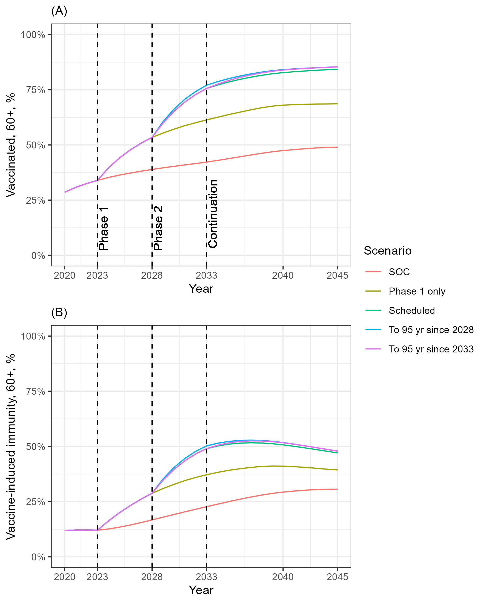

# The technology evaluation of recombinant zoster vaccine for preventing herpes zoster in people aged 80 and above

## Background

### Figure 1: Baseline vaccine-induced immunity in 2023. (epidemiology models)

Notes: blue bars indicate the people have been vaccinated with ZVL prior to 2023; red bars indicate the people have immunity against HZ remains; percentage values above are the shares of population in respective age groups.

## Objectives

The aim of this research is to assess the cost-effectiveness of using RZV on people aged 80 years and older within the England immunisation programme for Shingles, with the following objectives. 

- Evaluating whether vaccination is cost-effective for those older than the previous eligible upper bound (79 years old). 
- Evaluating the feasibility of re-vaccination with RZV for those who were previously vaccinated with ZVL
- Assessing whether a booster is needed in compensating the waned immunity when they are getting older. 

## Cost effectiveness of RZV

### Figure 2: Incremental cost-effectiveness ratios (ICERs) of RZV vaccination by single age of vaccination.  (cohort models) 

Notes: solid lines for the central estimators; shaded area for the 95% uncertainty intervals; dashed lines for willingness to pay thresholds. 

### Figure 3: Incremental cost-effectiveness ratios (ICERs) of RZV revaccination for who vaccinated with ZVL at 70 and 75 years old.  (cohort models) 

Notes: solid lines for the central estimators; shaded area for the 95% uncertainty intervals; dashed lines for willingness to pay thresholds.

## Immunity gaps caused by expanding the eligiblity of RZV to 60-79

### Figure 4: Vaccine-induced immunity, RZV, by age and age of vaccination. 

Notes: labels of panel indicate the current age of the individual; the x-axis is for the age at which they were vaccinated.

## People with ZVL revaccinated with RZV 

### Figure 5: Incremental cost-effectiveness ratios (ICERs) of RZV revaccination by age of revaccination. (cohort model)

## Epidemiological projections

#### Scenarios
- **SOC**: merely replace ZVL by RZV without expanding eligiblity
- **Phase 1 only**: expanding to 65 years since 2028 only
- **Scheduled**: full scheduled policy
- **To 95 years since 2028**: **Scheduled** + expanding eligibility to 95 years since 2028
- **To 95 years since 2033**: **Scheduled** + expanding eligibility to 95 years since 2033

### Figure 6: Trend of 60+ incidence rates by intervention scenarios. (epidemiology models)

### Figure 7: The trend of the vaccinated and those with vaccine-induced immunity from 2023 by intervention scenarios.

### Figure 8: The impacts by intervention scenarios. (epidemiology models) 
- **(A)** Time-series of cumulative QALYs gained by intervention scenarios. 
- **(B)** Time-series of cumulative cost. 
- **(C)** Incremental net monetary benefit, cumulating since the end of 2023, WTP of 30,000 GBP applied. 

